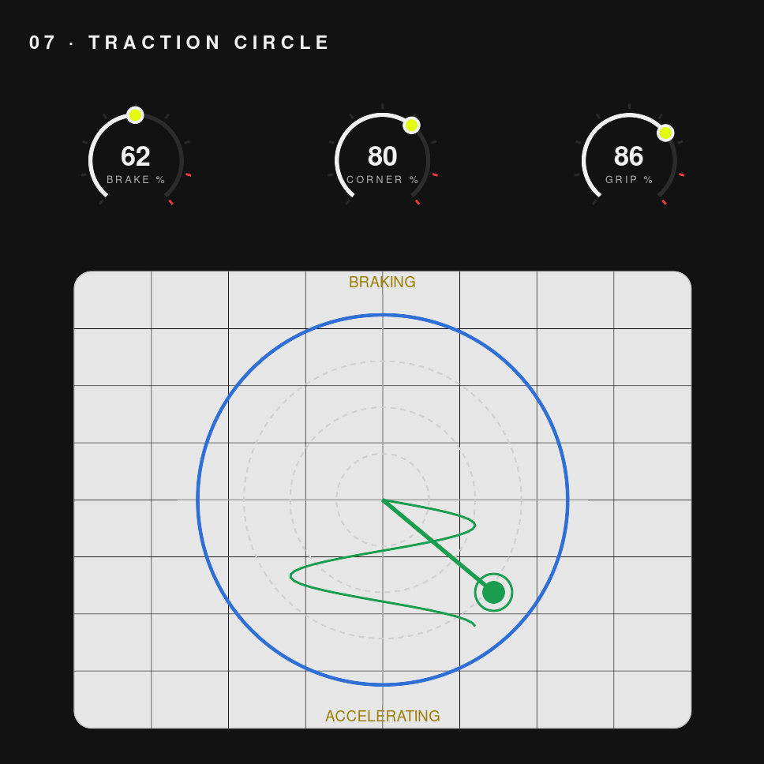
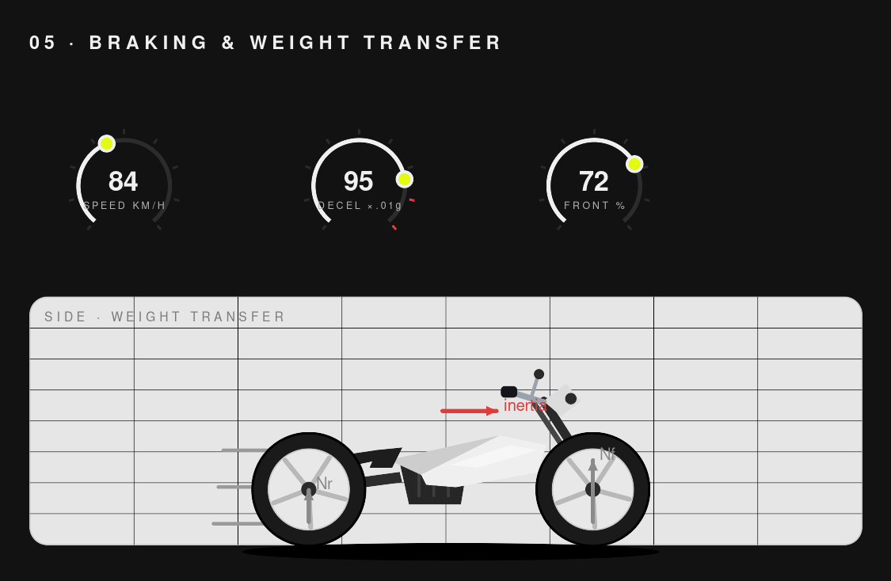
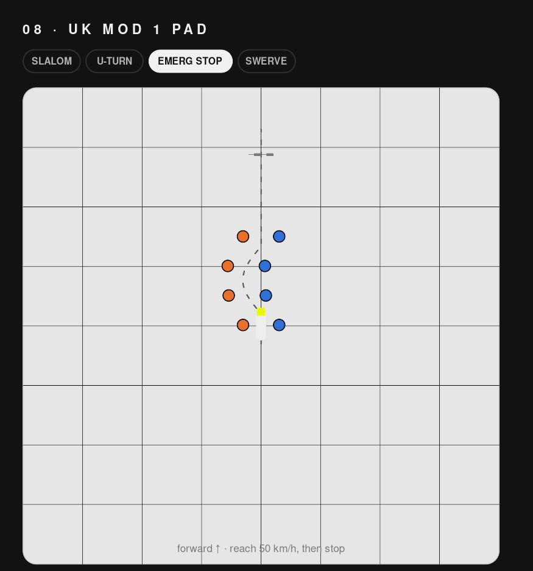
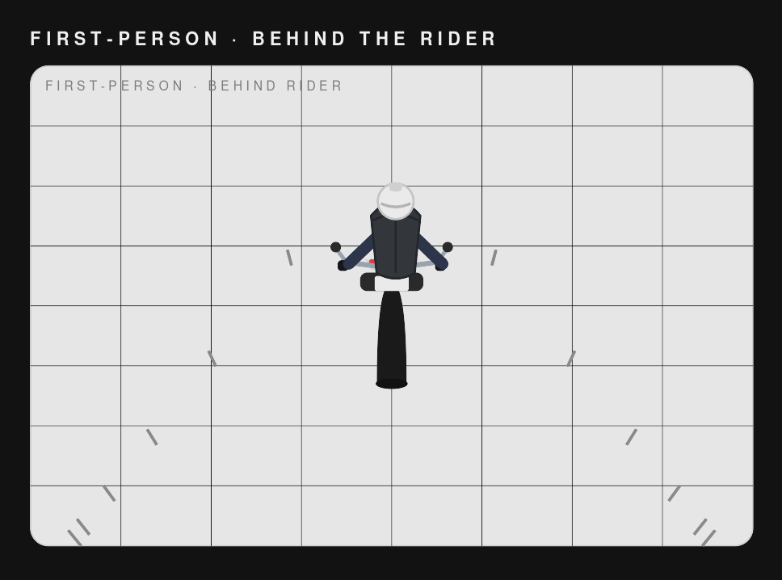
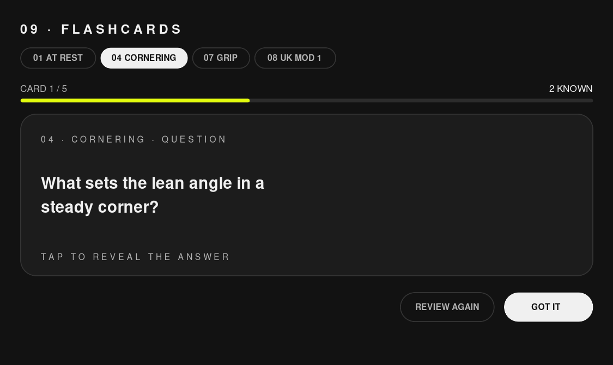
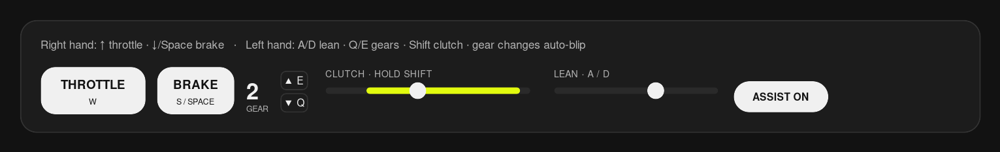
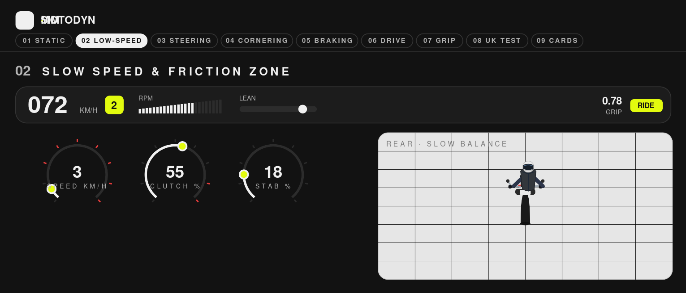
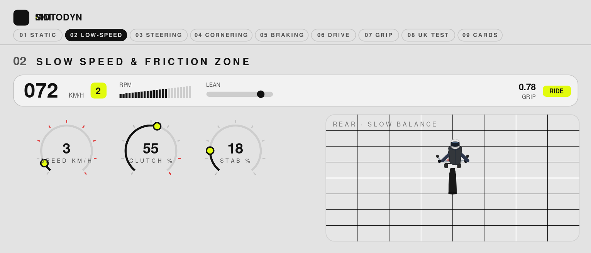

# 🏍️ Motorcycle Forces Simulator

An interactive, real-time simulator for understanding the **physics of riding a motorcycle**, and for practising the manoeuvres in the **UK Module 1 test**. You ride a single shared dynamics model with throttle, brake, clutch, gears and lean, and every screen is a different "lens" on what the forces are doing.

Built as a learning aid for someone working toward a full UK motorcycle licence, but useful for any rider who wants intuition for *why* the bike behaves the way it does.

> Educational model, simplified for intuition rather than engineering accuracy. Always get proper instruction and ride within your limits.

---

## 🎯 Goals

- **Make the invisible visible.** Show the forces (weight transfer, lean, grip, the traction circle) live, as you ride, instead of as static diagrams.
- **Teach the technique, not just the theory.** Tie every concept to what you actually *do* on the bike: countersteer, friction zone, progressive braking, trail braking.
- **Bridge to the real test.** Recreate the UK Mod 1 manoeuvring pad with DVSA-accurate cone layouts and pass/fail checks.
- **Stay approachable.** A clean, minimal interface, an Assist mode for beginners, and per-module flashcards to lock the ideas in.
- **Be self-contained.** Ships as a single offline HTML file, with no install and no network.

---

## 📦 What's in this MVP

A real-time physics engine shared by **nine modules**, plus the controls, conditions, audio, first-person view and revision deck built around it.

| Area | What it covers |
|------|----------------|
| **Physics engine** | Gear-dependent drive, 6-speed manual gearbox, clutch and friction zone, stalling and lugging, engine braking, road gradient, lean and countersteer, weight transfer, the traction circle, rpm, wheelie/stoppie/slide |
| **Learning modules** | 01 At Rest · 02 Slow Speed & Friction Zone · 03 Steering · 04 Cornering · 05 Braking · 06 Throttle & Traction · 07 Traction Circle |
| **UK Mod 1 pad** | Slalom, figure-of-eight, slow ride, U-turn, controlled stop, emergency stop, hazard avoidance, with DVSA cone colours, spacings and pass/fail |
| **Flashcards** | A revision deck per module with self-grading |
| **Controls** | Hand-split keyboard plus on-screen, clutch feathering, manual gears with auto-blip, and an **Assist** mode |
| **Conditions** | Surface (dry/wet/gravel/ice), gradient, load (solo/pillion/luggage), fed into the live model everywhere |
| **Feel** | Engine and tyre-scrub audio, a "behind the rider" first-person view, dark and light themes |

---

## ✨ Features

### Real-time cockpit and force diagrams
Every module reads the same running bike. Live gauges (speed, lean, lateral-g, grip), a cockpit HUD, and force vectors drawn straight onto the machine. Here, the lean and cornering forces in module 04.


### The traction circle
The idea that ties it all together: one grip budget shared between braking/accelerating and turning. Ride around and the dot traces your grip usage; cross the circle and you slide.



### Braking and weight transfer
Brake and momentum pitches the weight forward: the forks dive, the front loads up, the rear goes light. The diagram and load bars update live so you can *see* why the front brake does most of the work.



### UK Mod 1 manoeuvring pad
Ride the real test manoeuvres on a top-down pad with DVSA-accurate cones: orange-outside / blue-inside cornering lanes, the 7.5 m white-lined U-turn, yellow slalom, and the swerve's yellow-trigger, blue-hazard, four-cone stop box. Each manoeuvre is checked against its real constraints.



### First-person view
A "behind the rider" view available on every ride section. The rider faces away down the road (the helmet visor is the facing cue) and leans with you.



### Flashcards per module
A revision deck for each module: flip the card, grade yourself, track how many you knew, shuffle and repeat.



### Realistic controls: clutch, gears, Assist
Hand-split keyboard (throttle/brake on the right, lean/clutch/gears on the left) plus on-screen controls. Feather the clutch through the friction zone, shift a 6-speed box (gear changes auto-blip the clutch), or flip on **Assist** for auto-clutch and no stalling.



### Dark and light themes
A minimal, monospace, single-accent interface in both a dark cockpit and a clean daylight theme.

**Dark**



**Light**



---

## 🚀 Run it

**Quickest:** open **`MotoForcesSimulator.html`** in any modern browser. It's the whole app in one offline file.

**From source (for development):**

```bash
npm install
npm run dev      # start the Vite dev server
npm run build    # production build to dist/
```

### Controls

| Input | Keyboard | On-screen |
|-------|----------|-----------|
| Throttle | `Up` | Hold **Throttle** |
| Brake | `Down` / `Space` | Hold **Brake** |
| Lean / steer | `A` / `D` | Lean slider |
| Clutch | `Shift` (hold to feather) | Clutch slider |
| Gears | `E` up / `Q` down | up / down |
| Assist (auto-clutch) | n/a | **Assist** toggle |

Click anywhere on the page first so it has keyboard focus.

---

## 🛠️ Tech

- **React 18 + TypeScript**, **Tailwind CSS**, built with **Vite**
- A custom real-time dynamics engine (no game library) running on `requestAnimationFrame`
- All graphics are hand-drawn **SVG**: bikes, gauges, force vectors, the pad and the HUD
- Web Audio for the engine note and tyre scrub
- No backend; the production artifact is a single self-contained HTML file

---

## ⚠️ Disclaimer

This is an educational simulation with a deliberately simplified physics model. It is **not** a substitute for professional rider training or the official DVSA test. Always ride within your limits and get proper instruction.
